# Amazon S3

This hands-on will walk you through how I explored deploying a static website on Amazon S3.

## What I did
- Create a bucket in Amazon S3.
- Configure a bucket to host a static website.
- Upload content to a bucket.
- Turn on public access to bucket objects.
- Securely share a bucket object by using a presigned URL.
- Secure a bucket by using a bucket policy.
- Update the website.
- View object versions in the Amazon S3 console.

### Creating the bucket
I created a bucket on the console and configured its object ownership by enabling ACLs to specify control access to this bucket and its object. I disabled the block public access settings for this bucket because we will use the bucket to host a static website. Bucket versioning is also turned on so that the objects on this bucket will be versioned for updation and prevention of accidental deletion. Lastly I created tags to this bucket to organize buckets and track costs.

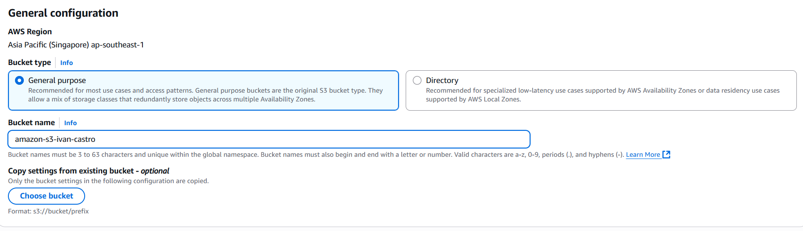
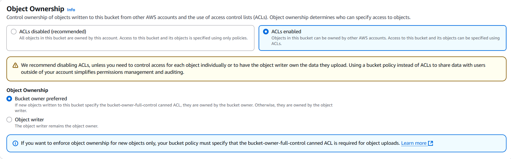
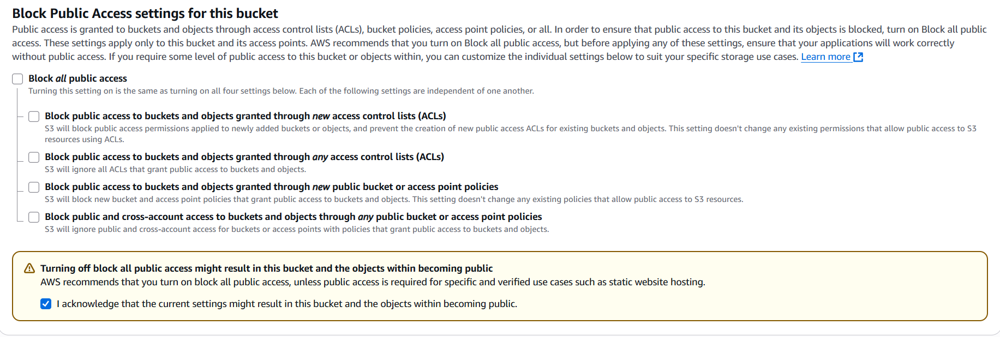
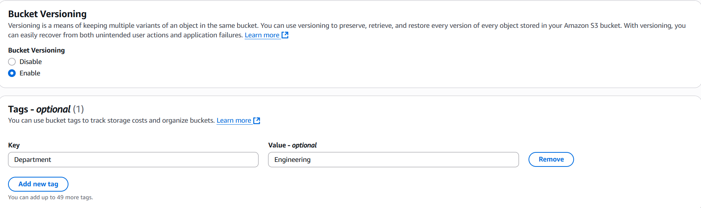
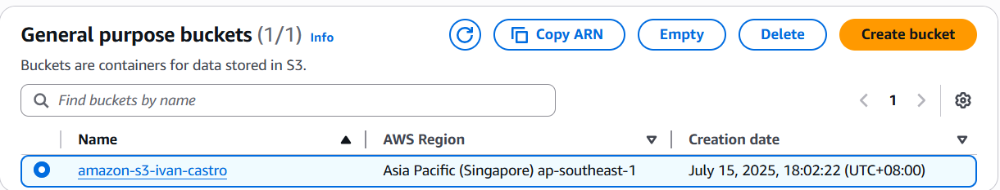

### Configure bucket to host static website
Hosting static website on Amazon S3 requires you to turn on static website hosting on your bucket's properties. We need to specify the html file for the default landing page for our static website we will input index.html as our default page. 
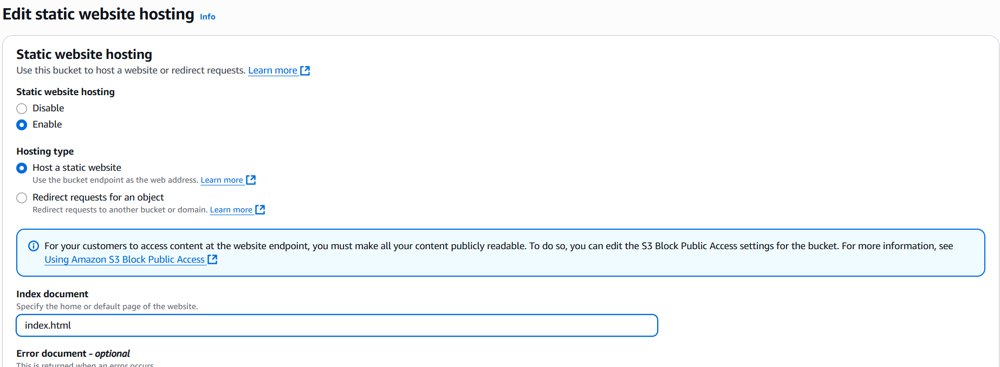
Now to access our static website we will click the link generated on bucket website endpoint that is the link to our static website.
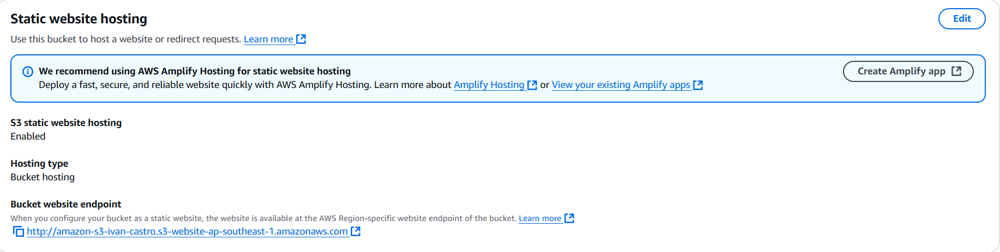
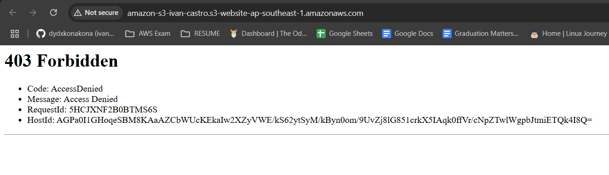
But as you can see the webpage says 403 Forbidden because we need to configure the bucket permissions. We need to do this because by default bucket's objects are private.

### Uploading content on the bucket
I uploaded the necessary files for my static website.
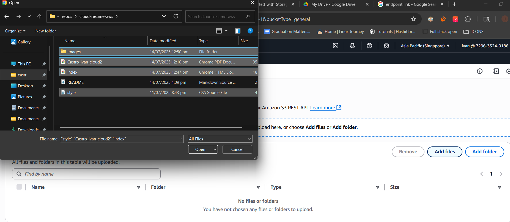
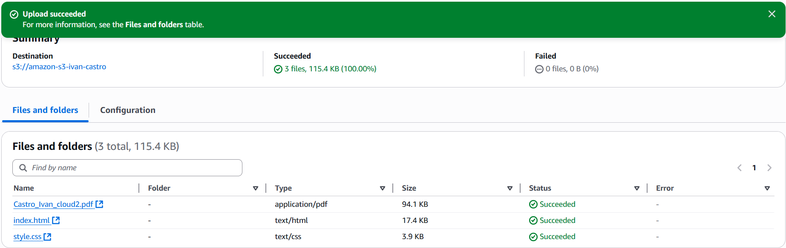

### Turn on public access to the objects
It is safer to make individual objects public instead of the whole bucket so I will make the individual objects by using access control list (ACL).
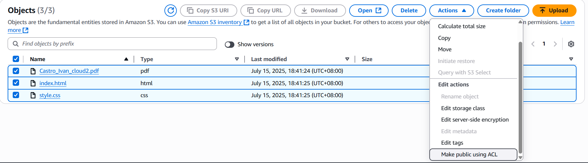
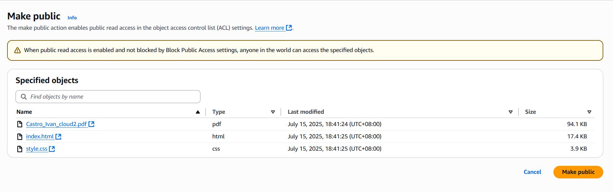
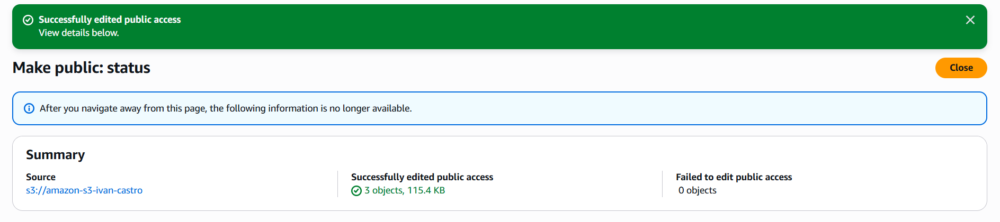
Now when we go to the static website link of our bucket we can see the static website the the Amazon S3 is hosting.
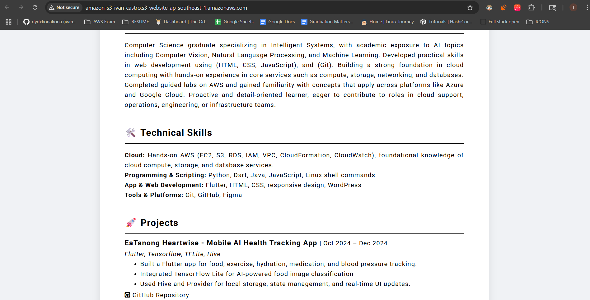

### Using presigned URL to securely share an object
When we want to share an object to others temporarily and securely we can create a presigned URL to do this. We can set the time interval until it expires.

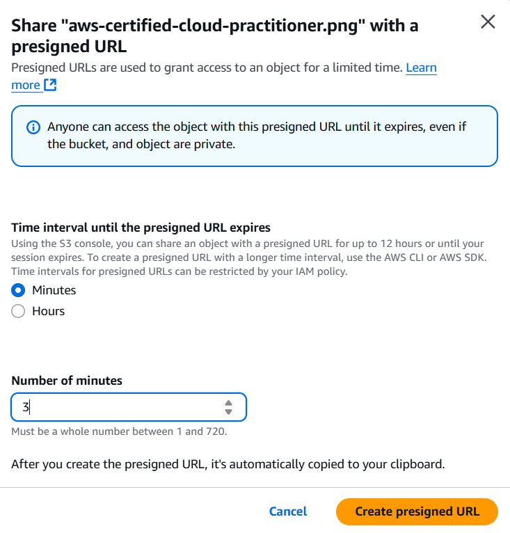
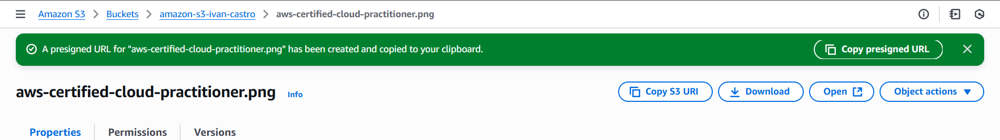
Now we can share the presign url with others and they can access the object through the url until it expires.
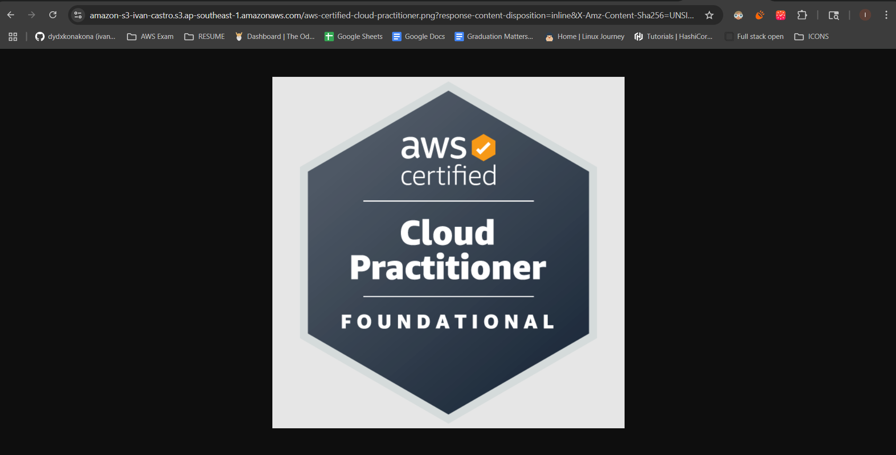
When it expires it will show an error
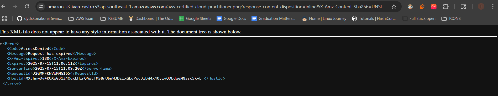

### Using bucket policy to secure the bucket
I will be using this bucket policy
```json
{
  "Version": "2012-10-17",
  "Statement": [
    {
      "Sid": "Statement1",
      "Effect": "Deny",
      "Principal": "*",
      "Action": [
        "s3:DeleteObject"
      ],
      "Resource": [
        "arn:aws:s3:::amazon-s3-ivan-castro/Castro_Ivan_cloud2.pdf",
        "arn:aws:s3:::amazon-s3-ivan-castro/index.html",
        "arn:aws:s3:::amazon-s3-ivan-castro/style.css",
        "arn:aws:s3:::amazon-s3-ivan-castro/aws-certified-cloud-practitioner.png"
      ]
    }
  ]
}
```
What does policy does is it allows all ("Principal": "*") not to be able to ("Effect": "Deny") to delete objects on the bucket ("Action": ["s3:DeleteObject"]) on these resources which are the objects specified in the bucket ("Resource": ["resources-listed"]).
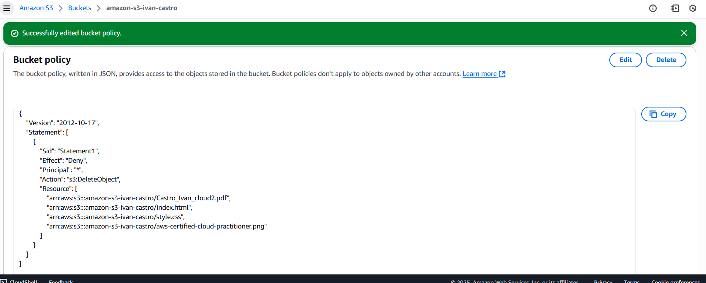
Now no one can delete objects on this bucket and we can demonstrate that the objects cannot be deleted even me as the creator.
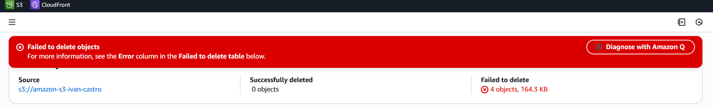

### Updating the Static Website
Let's demonstrate updating of the website by removing the styles on the css file and then reuploading the file. The resulting website should look like it doesn't have a css.
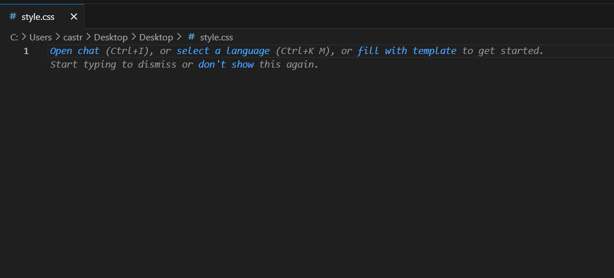
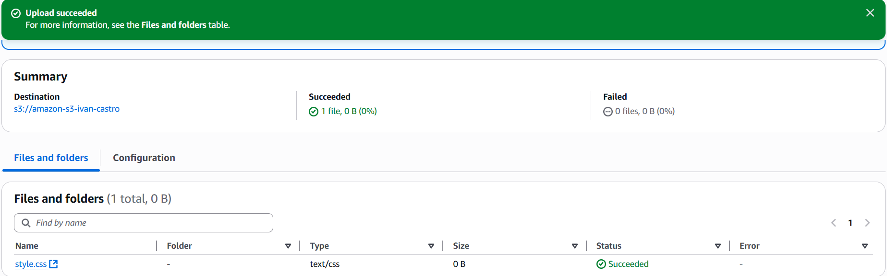
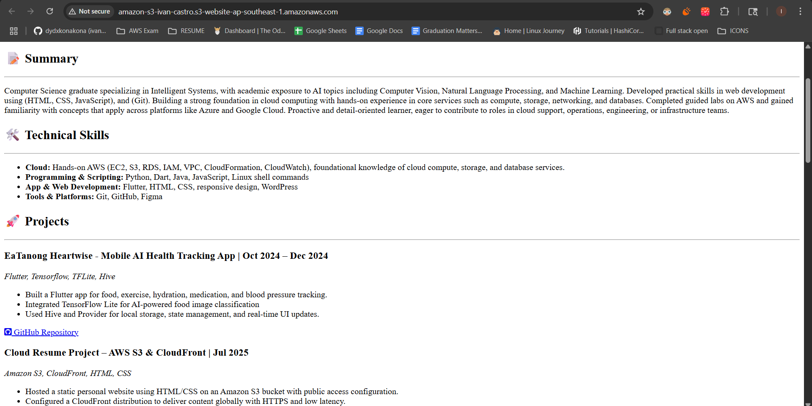
As we can see the website has been updated.

### File versions exploration
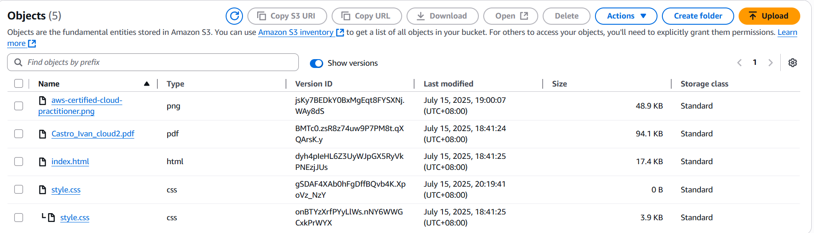
When we turned on the show versions we can see all the versions of our objects in our bucket. Each version has version id as we can see there are two version IDs for our style.css and that is because we reuploaded the file. 
