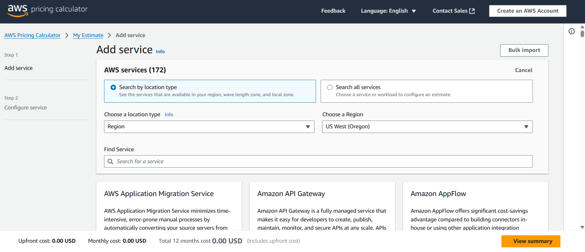
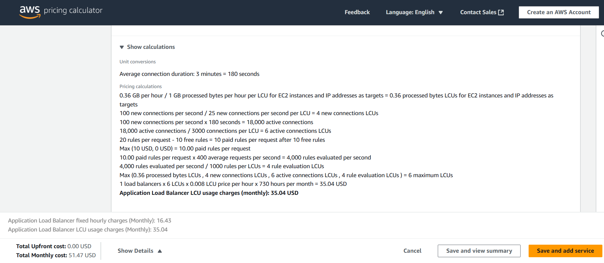
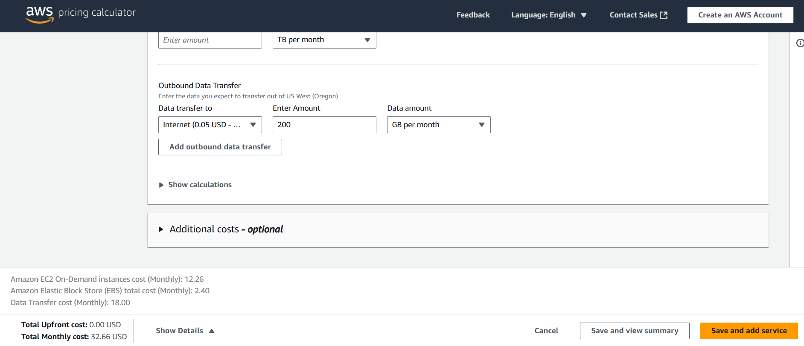
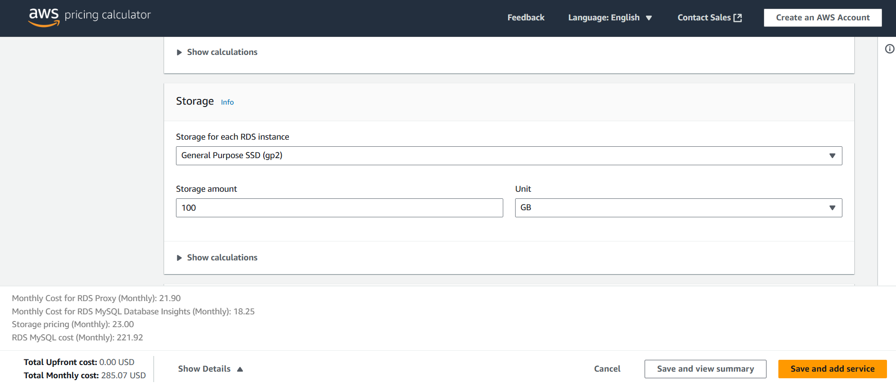
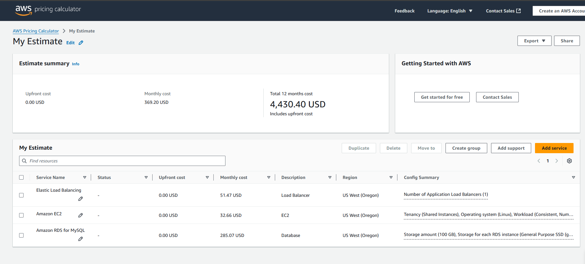
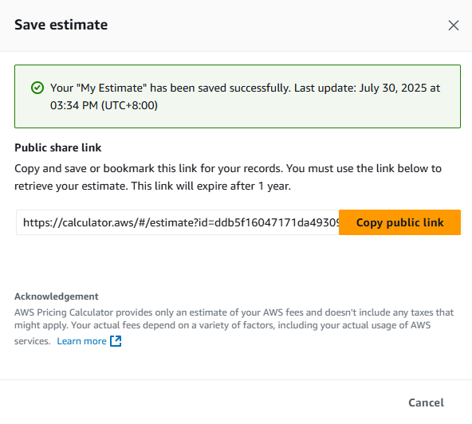
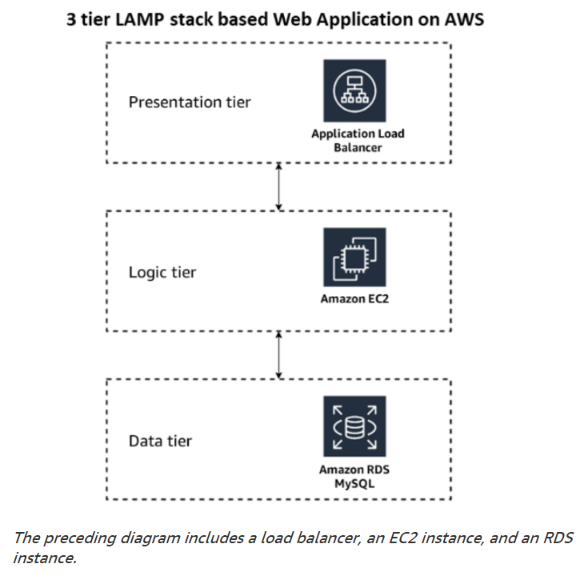

# AWS Pricing Calculator Hands-On Simulation  
**Service:** AWS Pricing Calculator  
**Objective:** Estimate AWS costs for a three-tier web application consisting of an ALB, EC2 instance, and RDS instance.

---

## Objectives

By the end of this lab, I was able to:

- Use AWS Pricing Calculator to estimate service costs
- Add a Load Balancer, EC2 instance, and RDS database to the estimate
- Save and share the cost estimate

---

## Task 1: Launch the AWS Pricing Calculator

**Steps:**

1. Open browser and go to: [https://calculator.aws/#/](https://calculator.aws/#/)
2. Click **Create estimate**

---

## Task 2: Add and Configure Services

### Add Load Balancer

1. Search for `Elastic Load Balancing`
2. Click **Configure**
3. Set:
   - **Description:** LoadBalancer
   - **Location Type:** Region
   - **Region:** US West (Oregon)
4. Enable **Application Load Balancer**
5. Choose **Load Balancer in AWS Region**
6. Set:
   - **ALBs:** 1
   - **Processed bytes:** 0.36 GB/hr
   - **New connections/sec:** 100
   - **Connection duration:** 3 minutes
   - **Requests/sec:** 400
   - **Rule evaluations/request:** 20
7. Click **Save and add service**

### Add EC2 Instance

1. Search for `EC2`, click **Configure**
2. Set:
   - **Description:** EC2
   - **Region:** US West (Oregon)
   - **OS:** Linux
3. **Workload:**
   - **Type:** Daily spike traffic
   - **Baseline:** 1, **Peak:** 2
4. **Instance Type:** t4g.small
5. **Pricing Strategy:** On-Demand
6. **Storage:**
   - Type: gp3, 30 GB
7. **Data Transfer:**
   - Inbound: 50 GB/month (Internet - free)
   - Outbound: 200 GB/month (Internet)

8. Click **Save and add service**

### Add RDS Instance

1. Search for `RDS`, click **Configure**
2. Set:
   - **Description:** Database
   - **Region:** US West (Oregon)
   - **Engine:** MySQL
   - **Instance Type:** db.m6g.large
   - **Deployment:** Multi-AZ
3. **Storage:**
   - Type: gp2, 100 GB
4. Click **Save and add service**

---

## Task 3: Review and Export Estimate

1. Click **View summary**
2. Review overall costs on **My Estimate** page
3. Click **Export > CSV**
4. In the dialog box, click **OK** and save the file locally

---

## Task 4: Save and Share Estimate

1. Click **Share**
2. In dialog, click **Agree and continue**
3. Click **Copy public link**
4. Share link via email or chat

> Note: AWS saves public estimates for up to 3 years.

---

## Simulation Complete

In this lab, I:

- Created a cost estimate using AWS Pricing Calculator
- Added and configured 3-tier architecture components
- Exported and shared the estimate
- Learned how to plan AWS spending ahead of deployment

---
