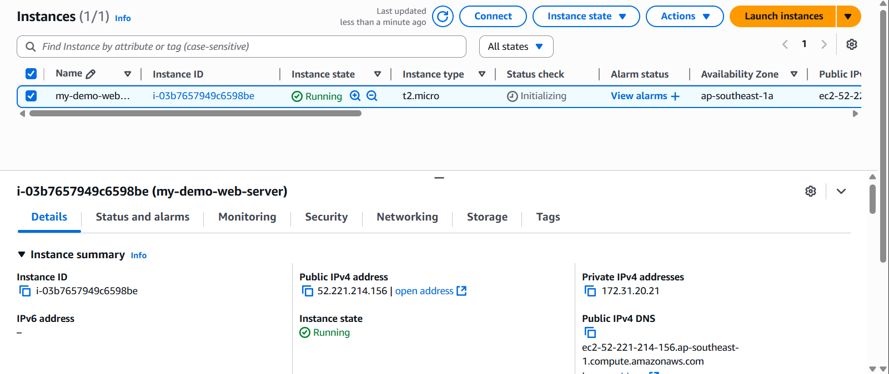
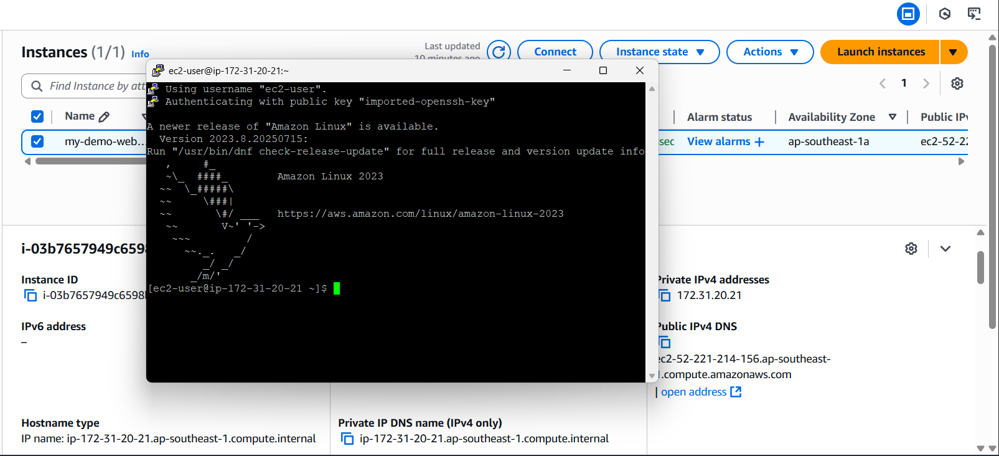

# Elastic Cloud Compute

This hands-on will walk you through how I launched a web server using Amazon EC2

## What I did

- Launch an EC2 instance with termination protection turned on.
- Monitor my EC2 instance.
- Modify the security group that my web server is using to allow HTTP access.
- Connect to my EC2 instance through HTTP and SSH.
- Connect to my EC2 instance using AWS Systems Manager Fleet Manager.
- Manage the state of an EC2 instance.
- Change the EC2 instance type.
- Test termination protection.
- Explore Amazon EC2 limits.

### Launching an EC2 Instance

I will name my EC2 instance my-demo-web-server and I will add tags to this instance for better categorization.


I will pick Amazon Linux for our AMI which basically means Linux will be the OS of our EC2 instance.


Instance type will be set to t2.micro and we will have the key pair EC2-my-demo-web-server, this key pair will allow us to SSH into our EC2 instance.


I will deploy the EC2 Instance in a default vpc determined by AWS and then attach launch-wizard-1 security group. This security group has inbound rules that allows http and shh access into our EC2 instances.


Termination protection is also turned on to preven accidental termination of EC2 Instance. Default EBS Volume is assigned to this also.


Lastly we will setup our EC2 user data using this code.

```sh
#!/bin/bash
# Use this for your user data (script from top to bottom)
# install httpd (Linux 2 version)
yum update -y
yum install -y httpd
systemctl start httpd
systemctl enable httpd
echo "<h1>Hello World from $(hostname -f)</h1>" > /var/www/html/index.html
```

This code will run when we launch our EC2 instance and it will only run at launch. It will install necessary software and display a hello world message. And now we launched the EC2 instance and we can view it now.



### Monitor Instance

It seems that both the System reachability and Instance reachability checks have passed.


On Monitoring tab it displays the Amazon Cloudwatch metrics for the instance such as CPU utilization and network usage.


I will check the system logs of the instance. We can see here the messages on the console output of the instance such as when the software packages has been installed as instructed in our EC2 user data. We can troubleshoot problems in the instance here so it's a good practice to check and read system logs.


I also have here what the EC2 instance look like if a screen were attached to it.


### Accessing the Web Server

I will access now the EC2 instance via http and see how it looks like.


I used the public ipv4 given by the AWS to access it (52.221.214.156).

Now I will try to connect to it via SSH.



Both of these operations are possible because EC2 has a firewall that has inbound rules that allows traffic from http and ssh from anywhere let's see what happens if we remove the inbound rules that allow http access into the EC2 instance. 


This will be the new inbound rules for launch-wizard-1 security group now let's try accessing the EC2 instance via http.


As we can see we cannot access it now via http using the public ipv4 address.
Now let's try to connect to the EC2 instance using using AWS Systems Manager Fleet Manager.With the Fleet Manager capability of AWS Systems Manager, you can remotely manage and configure your managed nodes. A managed node is any machine configured for Systems Manager.


### Resizing the Instance

If resizing is ever needed for the instance we can do it by first stopping the instance. After stopping it we can now resize in the instance settings.


Let's resize to t2.nano and apply the changes and let's start the instance again.


It has successfully resized the instance family of the instance is now t2.nano.

### Testing termination protection

I will try terminating the instance and see what happens.


It didn't work because termination protection is turned on, this is good because it will prevent accidental termination of EC2 instances. Now let's turn it off and then terminate it for good.


With termination protection turned off the EC2 instance is now terminated.
