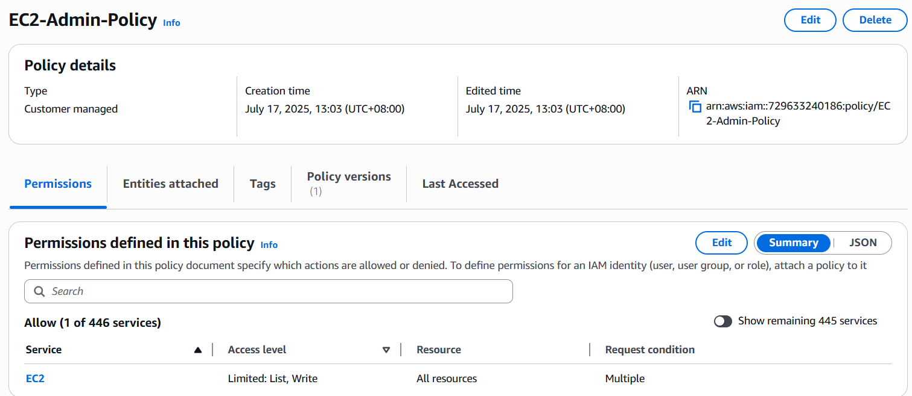
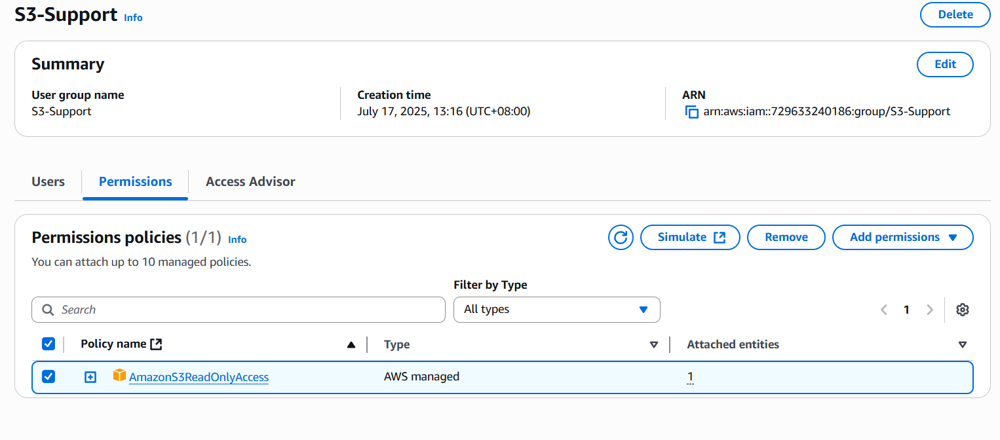
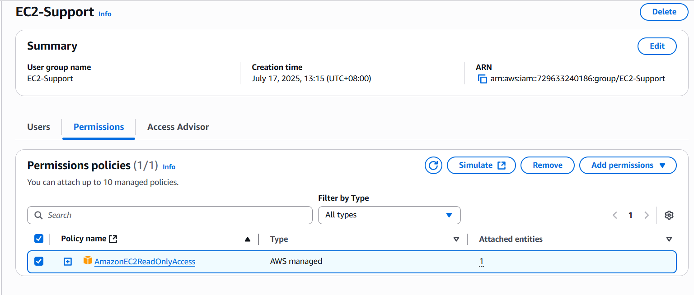
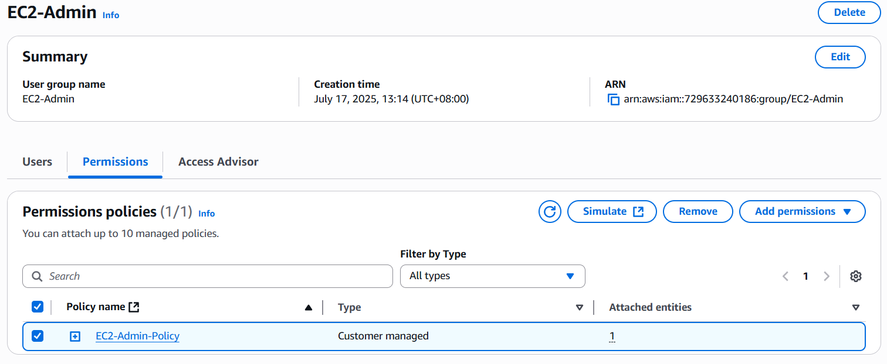
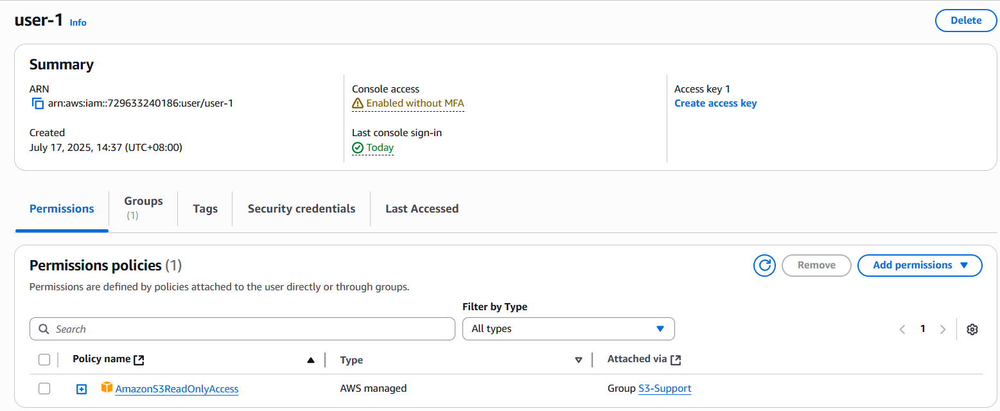
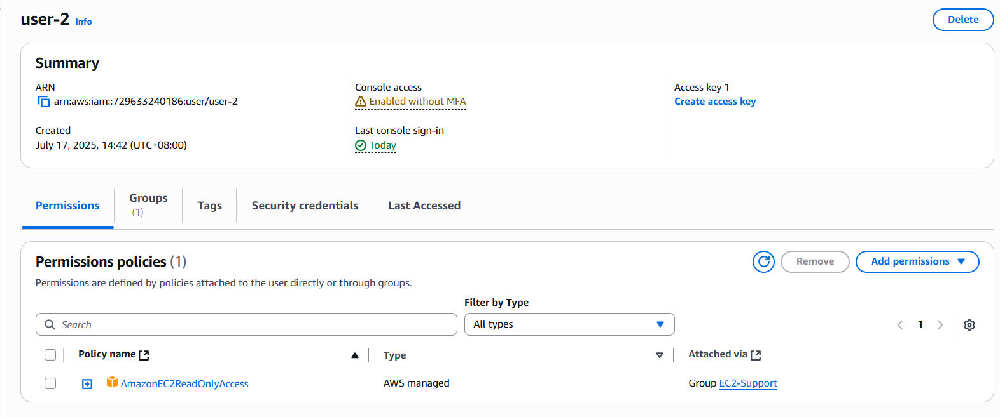
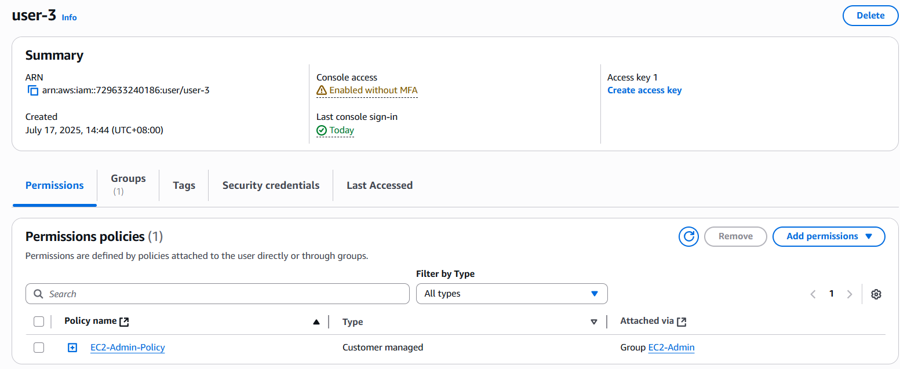
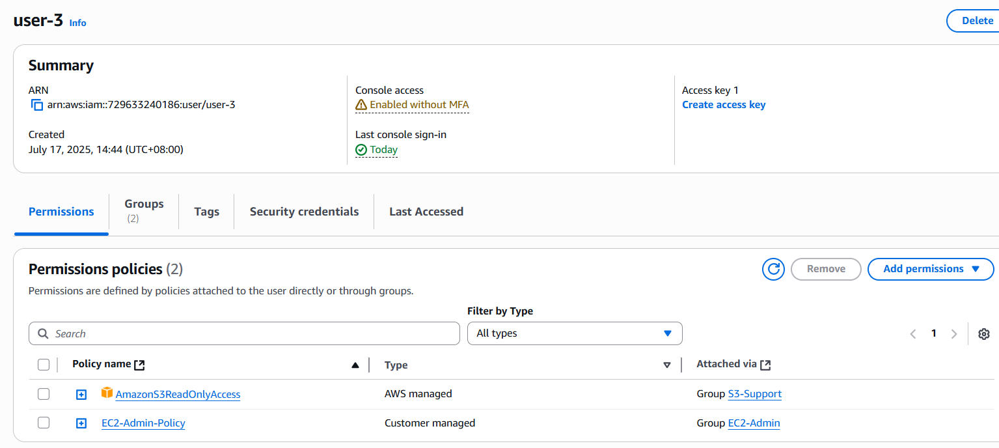

# Identity and Access Management (IAM)
This hands-on will focus on AWS Identity and Access Management.

## What I did
- Create a custom managed policy.
- Create IAM user groups with permission policies.
- Create IAM users and assign users to groups.
- Use user groups to add users to a group.
- Explore policy permissions that users inherit from groups.
- Log in as users to test the user’s permissions.
- Modify a user’s permission to provide additional access.

## Scenario
I want to create 3 user-groups with policies attached to them.
- S3-Support: with Read-only access to Amazon S3.
- EC2-Support: with Read-only access to Amazon EC2.
- EC2-Admin: with View, start, stop to Amazon EC2 Instances.

## Creating custom managed policy for EC2-Admin user-group
I created the following policy to enable view, start, stop Amazon EC2 instances.
```json
{
  "Version": "2012-10-17",
  "Statement": [
    {
      "Sid": "Statement1",
      "Effect": "Allow",
      "Action": [
        "ec2:DescribeInstances",
        "ec2:StartInstances",
        "ec2:StopInstances"
      ],
      "Resource": "*",
      "Condition": {
        "StringLikeIfExists": {
          "ec2:Owner": "amazon",
          "ec2:InstanceType": [
            "*.nano",
            "*.micro"
          ]
        }
      }
    }
  ]
}
```
This policy allows actions to view, start, and stop instances.
```json
"Effect": "Allow",
"Action": [
  "ec2:DescribeInstances",
  "ec2:StartInstances",
  "ec2:StopInstances"
],
```
It allows to perform those actions on all EC2 instances that are nano or micro family only.
```json
"Resource": "*",
"Condition": {
  "StringLikeIfExists": {
    "ec2:Owner": "amazon",
    "ec2:InstanceType": [
      "*.nano",
      "*.micro"
    ]
  }
}
```
I named the policy EC2-Admin-Policy



### Creating S3-Support, EC2-Support, and EC2-Admin user groups with policies.
S3-Support has AmazonS3ReadOnlyAccess.



EC2-Support has AmazonEC2ReadOnlyAccess.



EC2-Admin has my custom managed policy EC2-Admin-Policy



### Creating IAM users
user-1 is assigned to S3-Support user group.



user-2 is assigned to EC2-Support user group.



user-3 is assigned to EC2-Admin user group.



All of them inherited their respective user group's policies.

### Modifying permissions to allow user-3 to have a read only access to AmazonS3
I added user-3 to the S3-Support user group and now it inherits the group's permission to AmazonS3ReadOnlyAccess


