# AWS Lambda Hands-On Simulation  
**Service:** AWS Lambda + Amazon S3  
**Objective:** Trigger a Lambda function when an image is uploaded to S3, then resize the image and store the output in a different bucket.

---

## Objectives

By the end of this lab, I was able to:

- Create a Lambda function in Python
- Configure an S3 trigger to invoke the function
- Use environment variables within Lambda
- Resize uploaded images using the Pillow library
- Monitor and optimize Lambda performance using CloudWatch

---

## Task 1: Create a Lambda Function

**Steps:**

1. In the AWS Console, search for and open **Lambda**
2. Click **Create function**
3. Set:
   - **Function name:** `resize_image`
   - **Runtime:** Python 3.9
4. Expand **Change default execution role**
   - Select **Use an existing role**
   - Choose **ResizeImageLambdaRole**
5. Click **Create function**

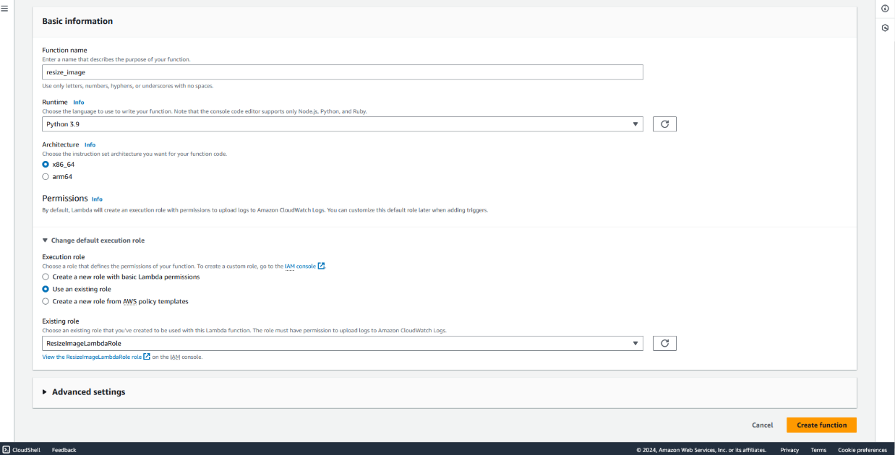

6. Scroll to the **Layers** section
   - Click **Add a layer**
   - Choose **Custom layers**
   - Select **PillowPythonLambdaLayer**
   - Choose the available version
   - Click **Add**

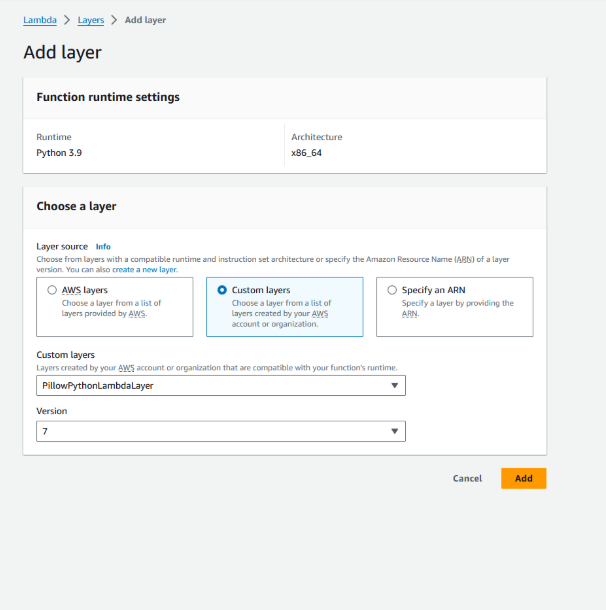

7. Scroll to the **Code source** section
   - Replace the default code in `lambda_function.py` with the image resizing code
  
```python
import boto3
import os
import sys
import uuid
from urllib.parse import unquote_plus
from PIL import Image
import PIL.Image

s3_client = boto3.client('s3')

def resize_image(image_path, resized_path):
   with Image.open(image_path) as image:
      image.thumbnail(tuple(x / 2 for x in image.size))
      image.save(resized_path)

def lambda_handler(event, context):
   print('Begin resizing image')
   for record in event['Records']:
      bucket = record['s3']['bucket']['name']
      key = unquote_plus(record['s3']['object']['key'])
      print(bucket)
      print(key)
      tmpkey = key.replace('/', '')
      download_path = '/tmp/{}{}'.format(uuid.uuid4(), tmpkey)
      upload_path = '/tmp/resized-{}'.format(tmpkey)
      s3_client.download_file(bucket, key, download_path)
      resize_image(download_path, upload_path)
      s3_client.upload_file(upload_path, os.environ['RESIZED_BUCKET'], key)
   print('Resizing image complete')
```

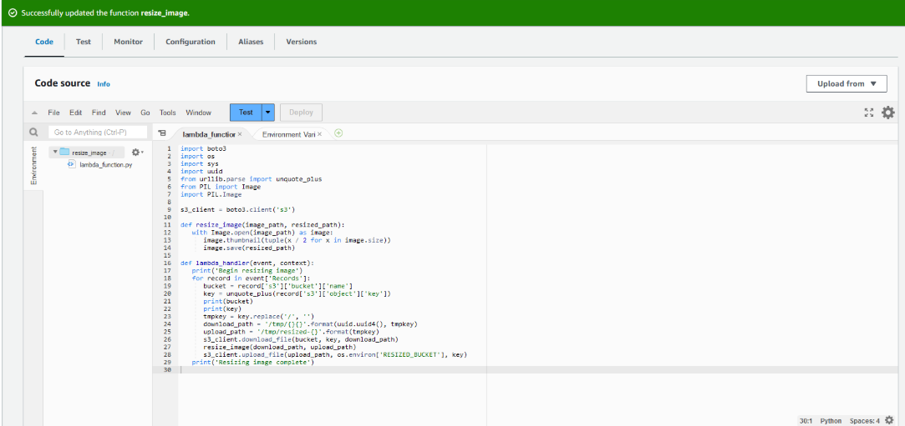

8. Click **Deploy**
9. Set memory to `512 MB` under the **Configuration tab**

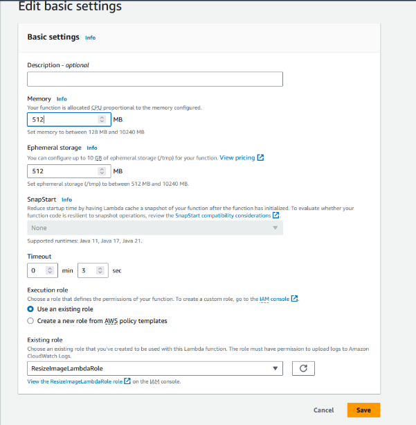

10. Set environment variable `RESIZED_BUCKET` to the resized bucket name

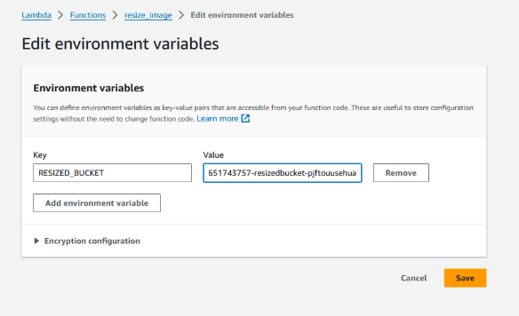

---

## Task 2: Configure S3 Trigger for Lambda

**Steps:**

1. Add a trigger from **S3**
2. Set bucket with `original` in its name
3. Event type: All object create events

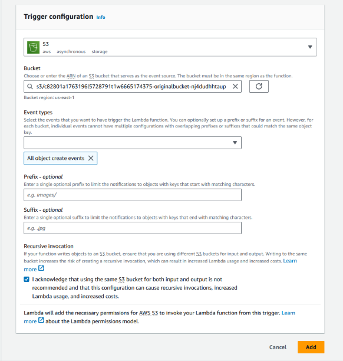

4. Confirm trigger was created and bucket ARN is correct

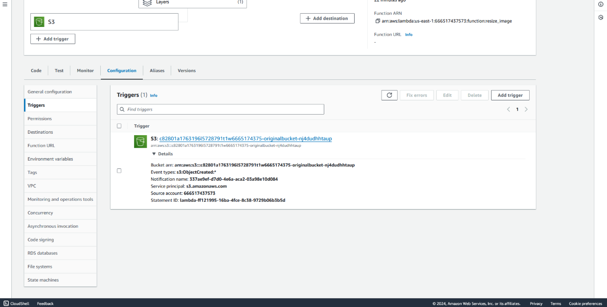

---

## Task 3: Upload Image to S3 Bucket

**Steps:**

1. Upload `large-image.jpg` to the original S3 bucket

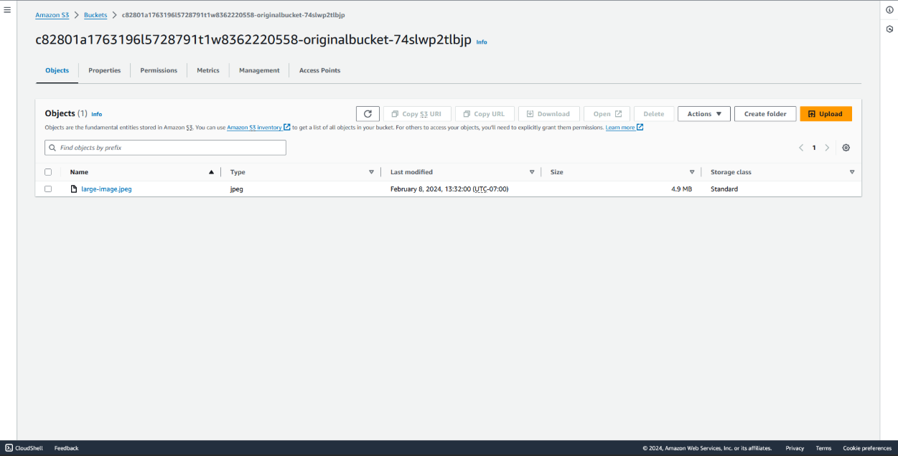

2. Confirm resized image appears in the resized bucket

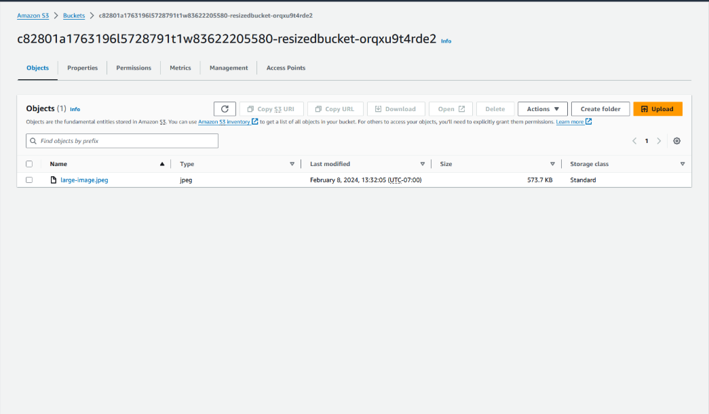

---

## Task 4: Review Lambda Logs & Metrics

**Steps:**

1. View recent invocations in the Monitor tab

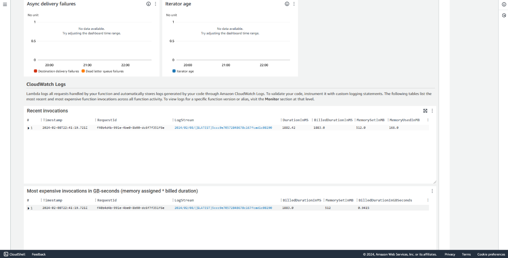

2. Inspect performance: duration, cold start time, memory

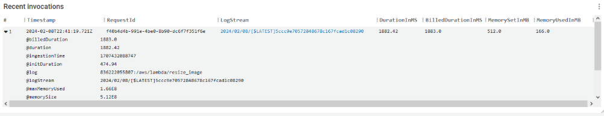

---

## Task 5: Optimize Lambda Memory for Performance

### Round 1: 1024 MB

- Set memory to `1024 MB`, re-upload image

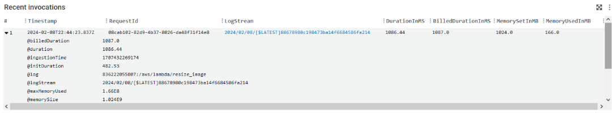

### Round 2: 2048 MB

- Set memory to `2048 MB`, re-upload image

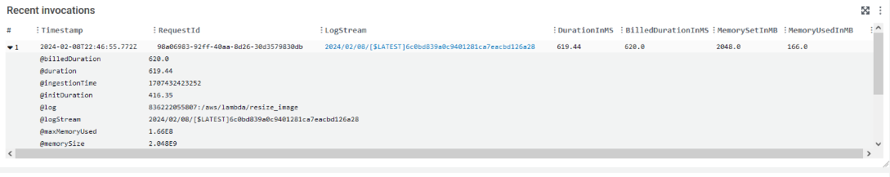

### Round 3: 3008 MB

- Set memory to `3008 MB`, re-upload image

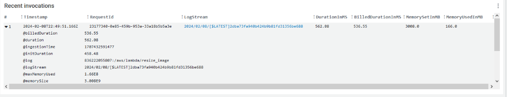

---

## Simulation Complete

In this hands-on simulation, I:

- Created a Python-based Lambda function to resize images
- Integrated it with Amazon S3 triggers
- Used environment variables for output configuration
- Optimized function performance by tuning memory
- Monitored logs and metrics using CloudWatch

> Final result: Image resizing triggered automatically via S3 event and completed under 1 second at 3008 MB.

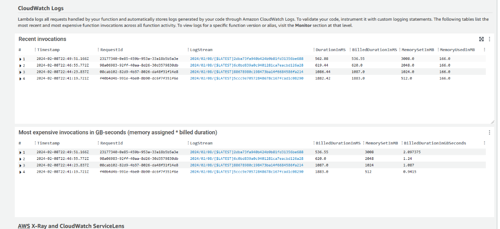
