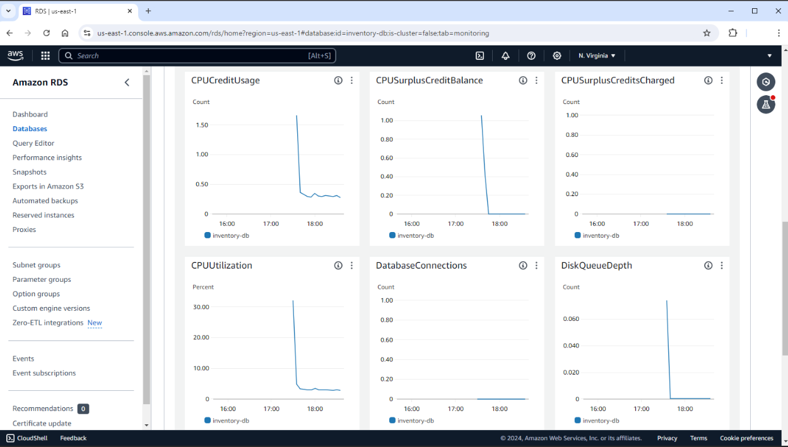

# Amazon RDS Hands-On Simulation  
**Service:** Amazon RDS for MySQL  
**Objective:** Provision and manage a MySQL database using Amazon RDS and connect it to a web application running on EC2.

---

## Objectives

By the end of this lab, I was able to:

- Launch a MySQL database using Amazon RDS
- Connect a web application (EC2-hosted) to the RDS instance
- Perform basic database monitoring using CloudWatch
- Perform administrative tasks such as stopping and restarting the DB instance

---

## Task 1: Create an Amazon RDS Database (MySQL)

**Steps:**

1. **Open RDS console** via the AWS Console search bar.
2. Choose **Create Database**.
3. Set the following options:
   - **Creation method:** Standard create
   - **Engine type:** MySQL
   - **Engine version:** MySQL 8.0.32
   - **Template:** Dev/Test
   - **Availability:** Single DB instance (not Multi-AZ)
4. **Settings:**
   - DB instance identifier: `inventory-db`
   - Master username: `admin`
   - Master password: `sim-password!`
5. **Instance configuration:**
   - Class: `db.t3.micro`
   - Storage: 20 GiB, General Purpose SSD (gp2), **autoscaling disabled**
6. **Connectivity:**
   - VPC: Select `Lab VPC`
   - Subnet group: `rds-lab-db-subnet-group`
   - Public access: No
   - VPC security group: `DB-SG` (remove default)
7. **Authentication:** Password-based
8. **Monitoring:** Enhanced monitoring disabled
9. **Additional configuration:**
   - Initial DB name: `inventory`
   - Encryption: Disabled
10. Choose **Create Database**  
    > Wait until the status becomes **Available**

---

## Task 2: Connect Web Application to RDS

**Environment Note:** A simulated EC2 instance with a web app was automatically deployed.

1. Open **EC2 > Instances** > Get **Public IPv4** of `App Server`
2. Visit the public IP in a new browser tab
3. Inside the web app, go to **Settings**
4. In another tab, return to **RDS > Databases > inventory-db**
   - Copy the **endpoint**
5. Back in the web app, input:
   - **Endpoint:** (Paste from RDS)
   - **Database:** `inventory`
   - **Username:** `admin`
   - **Password:** `sim-password!`
6. Click **Save**

Connection info is saved to **AWS Secrets Manager**

---

### Add & Edit Data

- Add new entry:
  - Store: `Atlanta`
  - Item: `Amazon Alexa`
  - Quantity: `7`
- Edit entry:
  - Change quantity of `Puerto Rico` from `12` → `5`

---

## Task 3: Monitor the RDS Instance

1. Go to **RDS > inventory-db > Monitoring**
2. Review available **Amazon CloudWatch metrics**
   - CPU Utilization
   - Connections
   - Read/Write Latency
   - Storage metrics

---

## Task 4: Manage RDS Instance

1. Go to **RDS > Databases > inventory-db**
2. Choose **Actions > Stop temporarily**
   - Acknowledge warning and confirm

Notes:
- RDS auto-restarts after 7 days
- Billing stops for compute, **but storage charges remain**

---

## Simulation Complete

In this hands-on exercise, I:

- Launched and configured an Amazon RDS for MySQL instance
- Integrated a web app hosted on EC2 with the RDS DB
- Performed basic CRUD operations
- Observed monitoring metrics via CloudWatch
- Performed administrative actions such as stopping the DB

---

