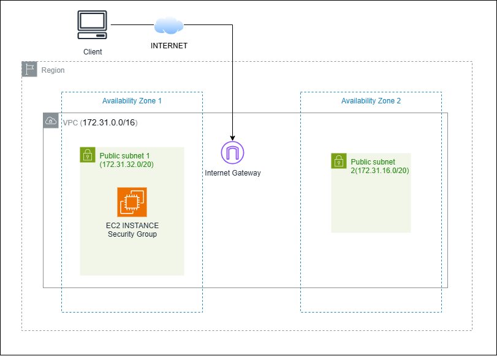

# Virtual Private Cloud

## What I Did

- Explore the basic components of a VPC.
- Deploy a basic VPC with public subnets.
- Deploy an Amazon Elastic Compute Cloud (Amazon EC2) instance into a VPC.
- Create this architecture

### Explore the default VPC

