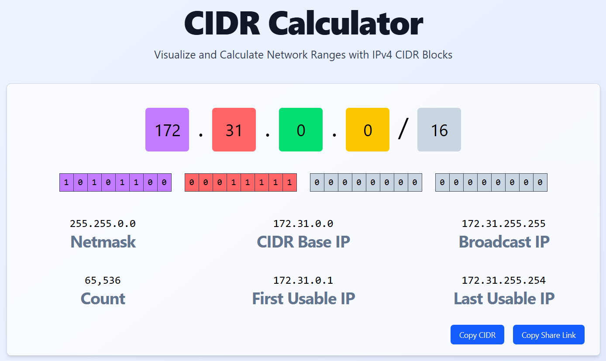
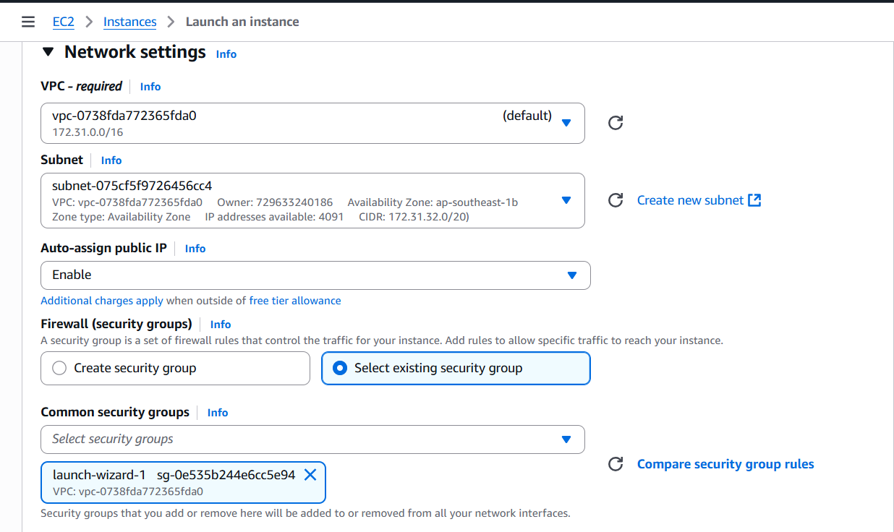

# Virtual Private Cloud

## What I Did

- Explore the basic components of a VPC.
<!-- - Deploy a basic VPC with public subnets. -->
- Deploy an Amazon Elastic Compute Cloud (Amazon EC2) instance into a VPC.

### Explore the default VPC

We can see here that the default vpc created by AWS has IPv4 CIDR range of 172.31.0.0/16 which means it has 65,536 ip addresses on this default vpc.

The default vpc has 3 public subnets in three availability zones. Each subnet has 20 as the prefix of their CIDR range which means they have 4091 ip addresses in each subnet.

This is the internet gateway this is used to allow public subnets to access the internet. It is currently attached to the vpc provided. In a more accurate sense it provides a target in route tables that connects to the internet.

This is the route table of the default vpc provided by AWS. It has two target routes one is local which allows all subnets in the VPC to communicate to one another and an internet gateway route which connects to the internet.

We can view the subnet associations to see which subnets are associated with this route table.

Currently there is none let's try adding a public subnet to it to allow that subnet to access the internet.

### Launching an EC2 instance into a VPC

Let's launch an EC2 instance to the default VPC and to a subnet.

Let's confirm whether the instance is in the subnet.

As we can see the subnet where we deployed are instance has it's available ip addresses from 4091 gone to 4090 which means the EC2 instance occupied that one ip address. We can also verify it on the instance itself by checking its vpc id and subnet id.

